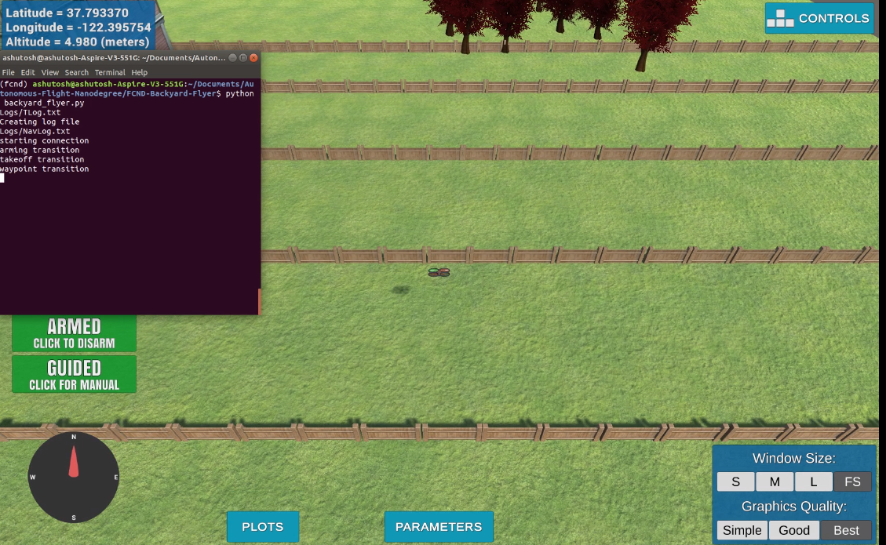

# Flying a Drone in backyard 


This is the first project of autonomous aerial vehicle nanodegree program of udacity. 
In this project, I have created a state machine using event-driven programming to autonomously flying a drone. I have used flying quadcopter in Unity simulator. While working on this project, The python code was developed to control the autonomous drone using Mavlink protocol from a ground station computer or an onboard flight computer.

## Step 1: Download the Simulator
Download the version of the simulator that's appropriate for your operating system [from this repository](https://github.com/udacity/FCND-Simulator-Releases/releases).

## Step 2: Set up your Python Environment
Set up your Python environment and get all the relevant packages installed using Anaconda following instructions in [this repository](https://github.com/udacity/FCND-Term1-Starter-Kit)

## Step 3: Clone this Repository
```sh
git clone https://github.com/Ashutosh-Badave/Backyard_Flyer.git
```

## Manual and Autonomous Drone flight
You can fly this drone in two ways: using manual control and then under autonomous control.

Manual control of the drone is done using the instructions found with the simulator.

Autonomous control will be done using an event-driven state machine. 

## Drone API

To communicate with the simulator (and a real drone), you will be using the [UdaciDrone API](https://udacity.github.io/udacidrone/).  This API handles all the communication between Python and the drone simulator.  A key element of the API is the `Drone` superclass that contains the commands to be passed to the simulator and allows you to register callbacks/listeners on changes to the drone's attributes. 

### Manual Flight

To log data while flying manually, run the `drone.py` script as shown below:

```sh
python drone.py
```

Run this script after starting the simulator. It connects to the simulator using the Drone class and runs until tcp connection is broken. The connection will timeout if it doesn't receive a heartbeat message once every 10 seconds. The GPS data is automatically logged.

To stop logging data, stop the simulator first and the script will automatically terminate after approximately 10 seconds.

Alternatively, the drone can be manually started/stopped from a python/ipython shell:

```python
from udacidrone import Drone
from udacidrone.connection import MavlinkConnection
conn = MavlinkConnection('tcp:127.0.0.1:5760', threaded=False)
drone = Drone(conn,tlog_name="TLog-manual.txt")
drone.start()
```

If `threaded` is set to `False`, the code will block and the drone logging can only be stopped by terminating the simulation. If the connection is threaded, the drone can be commanded using the commands described above, and the connection can be stopped (and the log properly closed) using:

```python
drone.stop()
```

When starting the drone manually from a python/ipython shell you have the option to provide a desired filename for the telemetry log file (such as "TLog-manual.txt" as shown above).  This allows you to customize the telemetry log name as desired to help keep track of different types of log files you might have.  Note that when running the drone from `python drone.py` for manual flight, the telemetry log will default to "TLog-manual.txt".

### Running the Autonomous Drone

You can run the mission:

```sh
python backyard_flyer.py
```

Similar to the manual flight, the GPS data is automatically logged to the specified log file.

## Autonomous Control State Machine

Below are the designed states of a state machine to fly the drone autonomously. The state machine is run continuously until either the mission is ended or the Mavlink connection is lost.

The six states predefined for the state machine:
* MANUAL: the drone is being controlled by the user
* ARMING: the drone is in guided mode and being armed
* TAKEOFF: the drone is taking off from the ground
* WAYPOINT: the drone is flying to a specified target position
* LANDING: the drone is landing on the ground
* DISARMING: the drone is disarming

While the drone is in each state, it checks the transition criteria with a registered callback. If the transition criteria are met, it will set the next state and pass along next commands to the drone. For example:

```python
def state_callback(self):
	if self.state == States.DISARMING:
    	if !self.armed:
        	self.release_control()
        	self.in_mission = False
        	self.state = States.MANUAL
```

This is a callback on the state message. It only checks anything if it's in the DISARMING state. If it detects that the drone is successfully disarmed, it sets the mode back to manual and terminates the mission.       

### Message Logging

The telemetry data is automatically logged in "Logs\TLog.txt" or "Logs\TLog-manual.txt" for logs created when running `python drone.py`. Each row contains a comma seperated representation of each message. The first row is the incoming message type. The second row is the time. The rest of the rows contains all the message properties. The types of messages relevant to this project are:

* `MsgID.STATE`: time (ms), armed (bool), guided (bool)
* `MsgID.GLOBAL_POSITION`: time (ms), longitude (deg), latitude (deg), altitude (meter)
* `MsgID.GLOBAL_HOME`: time (ms), longitude (deg), latitude (deg), altitude (meter)
* `MsgID.LOCAL_POSITION`: time (ms), north (meter), east (meter), down (meter)
* `MsgID.LOCAL_VELOCITY`: time (ms), north (meter), east (meter), down (meter) 


#### Reading Telemetry Logs

Logs can be read using:

```python
t_log = Drone.read_telemetry_data(filename)
```

The data is stored as a dictionary of message types. For each message type, there is a list of numpy arrays. For example, to access the longitude and latitude from a `MsgID.GLOBAL_POSITION`:

```python
# Time is always the first entry in the list
time = t_log['MsgID.GLOBAL_POSITION'][0][:]
longitude = t_log['MsgID.GLOBAL_POSITION'][1][:]
latitude = t_log['MsgID.GLOBAL_POSITION'][2][:]
```

The data between different messages will not be time synced since they are recorded at different times.

### Reference Frames

Two different reference frames are used. Global positions are defined [longitude, latitude, altitude (pos up)]. Local reference frames are defined [North, East, Down (pos down)] and is relative to a nearby global home provided. Both reference frames are defined in a proper right-handed reference frame . The global reference frame is what is provided by the Drone's GPS, but degrees are difficult to work with on a small scale. Conversion to a local frame allows for easy calculation of m level distances. Two convenience function are provided to convert between the two frames. These functions are wrappers on `utm` library functions.

```python
# Convert a local position (north, east, down) relative to the home position to a global position (lon, lat, up)
def local_to_global(local_position, global_home):

# Convert a global position (lon, lat, up) to a local position (north, east, down) relative to the home position
def global_to_local(global_position, global_home):
```
